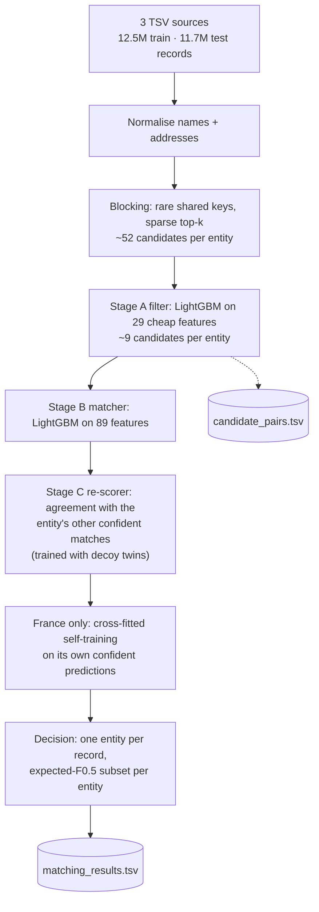
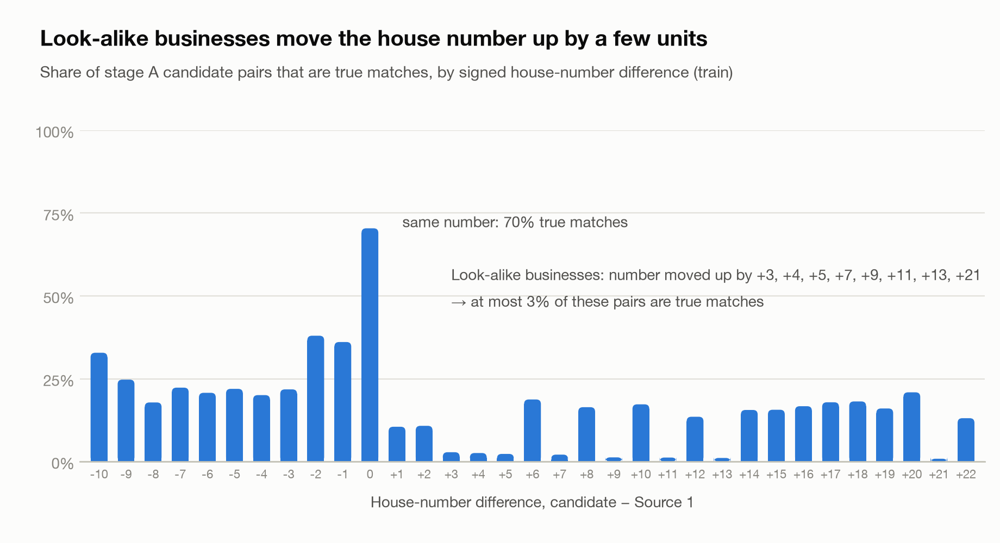
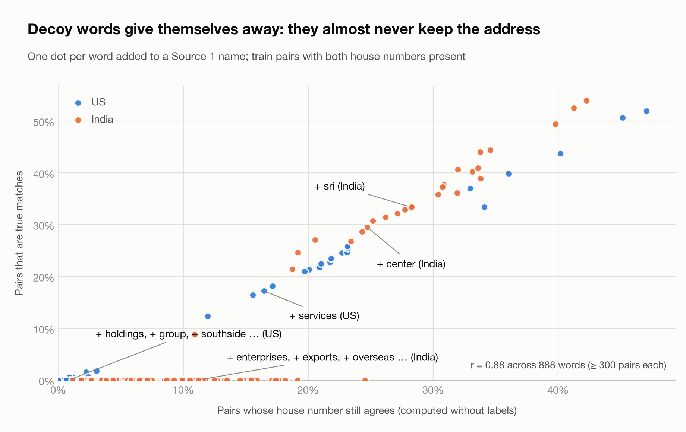

<div align="center">

# Business Entity Resolution

**Amazon ML Challenge 2026** · solution on branch `Dave`

Link every business in a clean reference list to its noisy copies from two other data vendors,<br>
using nothing but names and addresses.


-2a78d6)


| Macro F0.5 (out-of-fold) | Blocking recall | Candidates per entity | End-to-end runtime |
|:---:|:---:|:---:|:---:|
| **0.9876** | **98.2%** | **~9** | **~2 h** |

</div>

---

## Contents

- [The problem](#the-problem)
- [Results](#results)
- [How it works](#how-it-works)
- [What the data taught us](#what-the-data-taught-us)
- [What the leaderboard taught us](#what-the-leaderboard-taught-us)
- [Quick start](#quick-start)
- [Repository layout](#repository-layout)
- [Evaluation details](#evaluation-details)
- [Rules and compliance](#rules-and-compliance)

---

## The problem

Business records arrive from three independent vendors with **no shared ID**. **Source 1** is a
clean, deduplicated reference list; **Source 2** and **Source 3** are noisy. For every Source 1
business we must return *all* of its matching Source 2/3 records: zero, one or many. The full
statement is in [`Problem_Statement.md`](Problem_Statement.md).

An illustrative example of what one business looks like across sources:

| Source | Name | Address | Same business? |
|---|---|---|:---:|
| **1 (reference)** | Acme Robotics Inc. | 500 Market St, San Jose, CA | — |
| 2 | ACME ROBOTICS INCORPORATED | 500 MARKET STREET, SAN JOSE, null, CA | ✅ |
| 3 | acmerobotics.com | 500 Market Street, San Jose, California | ✅ |
| 3 | \>\> Acme Rob0tics - 4085550199 | 0500 Market St, San Jose, California | ✅ |
| 2 | Acme Robotics Holdings | 503 MARKET ST, SAN JOSE, CA | ❌ look-alike |

Indian records also arrive in nine native scripts (Devanagari, Tamil, Telugu, Kannada, Bengali, …):
`सन मार्केटिंग प्राइवेट लिमिटेड` = *Sun Marketing Private Limited*. The test set adds **France**, a country that never appears in training.

**Scoring** is macro **F0.5** per Source 1 entity, which weights precision twice as much as recall. A
singleton (no true matches) scores 1.0 for an empty prediction and 0 for anything else.

| Split | Source 1 | Source 2 | Source 3 | Countries |
|---|---:|---:|---:|---|
| train | 2.21M | 5.03M | 5.29M | US, India |
| test | 1.73M | 4.89M | 5.08M | US, India, **France** |

---

## Results

Out-of-fold macro F0.5 on all 2.21M training entities (3 folds grouped by Source 1 entity):

| Configuration | Train candidate lists | Test-like (decoy twins added) |
|---|:---:|:---:|
| Stage A filter score + best threshold | 0.9679 | |
| Stage B matcher + threshold 0.5 | 0.9859 | |
| Stage B matcher + expected-F0.5 selection | 0.9869 | 0.9867 |
| v2 stage C re-scorer + expected-F0.5 | 0.9880 | **0.9815** |
| **v3 stage C (trained with decoy twins, decoy-shift cap) + expected-F0.5** (submitted) | **0.9876** | **0.9880** |

Per country (v3, train candidate lists): **US 0.9878**, **India 0.9874**. The right-hand column
adds a twin to a share of the training look-alikes, the way the test data builds them (see
[What the leaderboard taught us](#what-the-leaderboard-taught-us)). v2 scored **0.976** on the
leaderboard even though it scored 0.988 out-of-fold; that column reproduces the drop and v3 fixes it.

France never appears in training, so we simulated that situation. A matcher trained on US only and
scored on India reaches 0.9517, and self-training on India's own confident predictions lifts it to
0.9555. (Stage A features were excluded for this test because stage A saw India labels.) The
submitted models learn from both countries, and France additionally gets self-training.

On the test set, the v3 submission has 5.86M predicted matches: 3.36 (India), 3.37 (US) and
3.49 (France) per entity, with 5.8%, 5.8% and 5.0% of entities left empty (the training
singleton rate is 5.6%). It passes the organisers' validator, including the ID check.

---

## How it works



| Stage | What it does | Kept on train |
|---|---|---|
| **Normalise** | Converts native-script names with a word dictionary learned from training pairs, then `anyascii`. Strips junk (`>>`, `(ID: 51154)`, phone numbers). Splits `d/b/a` aliases and undoes OCR digits (`8ody` → `body`). Splits domains and hashtags into words (`jayproducts.com` → `jay products`). Canonicalises legal forms, street abbreviations, ordinals and states (`TN` = `Tamil Nadu` = `தமிழ்நாடு`). | — |
| **Blocking** | Pairs records that share rare keys (name words, street words, house number × street, name word × number, …) within the same country. Scores are summed IDF weights; top-k is taken per key family, computed as a sparse matrix product (`sparse_dot_topn`), with a fixed per-record tie-break so runs are reproducible. | 115.8M pairs · 98.2% of true pairs |
| **Stage A** | A cheap LightGBM filter (2-fold cross-fitted) over rapidfuzz similarities, overlaps and house-number agreement. Its output is `candidate_pairs.tsv`. | 16.3M pairs · 99.996% of blocked true pairs |
| **Stage B** | A LightGBM matcher on 89 features: name and address similarities, IDF overlaps, house-number relationships, made-up-name signals, label-free *modifier statistics* and competition context. | probabilities |
| **Stage C** | Re-scores every pair with stage B's score plus *agreement* features: does this candidate share the house number, street and name that the entity's other confident matches carry, and how strongly do competing Source 1 entities claim the same record? Trained on out-of-fold stage B scores, with *decoy twins* added so that two look-alikes backing each other up are not mistaken for true copies. At decoy-style house-number shifts it may not raise a pair above stage B. | probabilities |
| **Self-training** | For countries absent from training (France), confident stage C predictions (≥ 0.98 or ≤ 0.02) become pseudo-labels and the matcher is retrained with them. It is cross-fitted, so no pair is scored by a model that saw its own pseudo-label. | France only |
| **Decision** | Each Source 2/3 record keeps only its best Source 1 entity. Each entity then keeps the top-k candidates that maximise its **expected F0.5**, computed exactly with Poisson-binomial dynamic programming. | 5.93M matches (test) |

---

## What the data taught us

### 1. Look-alike businesses move the house number *up*

About a quarter of Source 2/3 records match nothing. Most are synthetic siblings of a real business:
the same street, a house number shifted by a few units, and a slightly changed name. True copies keep
the number or corrupt it in other ways (truncation `570 → 57`, zero-padding `6806 → 006806`,
inserted hyphens `1603 → 16-03`). The signed difference alone separates the two:

<picture>
  <source media="(prefers-color-scheme: dark)" srcset="docs/assets/house_number_shift_dark.png">
  
</picture>

### 2. Decoy words give themselves away, without labels

Look-alikes also get a word added to the name (`+ Holdings`, `+ Southside`, `+ Enterprises`),
while real copies pick up harmless noise (`+ Services`, `+ Sri`, `+ Center`). For every word we
measure how often the house number still agrees when that word is added. This needs **no labels**,
so we recompute it on the test data, which lets it adapt to France's own vocabulary (`groupe`,
`holding`, `participations`, …).

<picture>
  <source media="(prefers-color-scheme: dark)" srcset="docs/assets/modifier_words_dark.png">
  
</picture>

### 3. Transliteration can be learned from the labels

In 99.998% of labelled pairs, a native-script name has exactly as many words as its Latin Source 1
name. Aligning the words by position yields 1,347 word translations (`லிமிடெட்` → `limited`,
`प्रा.` → `pvt`) with no external resources.

### 4. The metric rewards knowing when not to answer

Most of the remaining loss comes from records with **no address and a name shared by dozens of
Source 1 businesses**, which no model can attribute. Maximising expected per-entity F0.5 makes
declining to predict a deliberate, scored decision rather than a threshold accident.

### 5. True copies agree with each other

Most copies of one business carry the same house number, street and name, while a group of
look-alikes carries a different, shifted number. Stage C checks every candidate against the entity's
other confident matches. That lifts out-of-fold F0.5 from 0.9869 to 0.9880, and it also catches
Source 1 records whose own address holds the typo. It also has a trap, described next.

Data behind the charts: [`house_number_shift.csv`](docs/assets/house_number_shift.csv),
[`modifier_words.csv`](docs/assets/modifier_words.csv).

---

## What the leaderboard taught us

v2 scored **0.976** on the leaderboard against 0.988 out-of-fold. Without test labels, we compared
what the model *predicts* on test with what the training labels say it *should* look like. That
exposed a change in how the test data builds look-alikes.

**In test, look-alikes come in pairs.** In training, a look-alike is usually one record at a shifted
house number. In test it is often two records with slightly different names at the same shifted
number, for example `The Apex Superior Solar Corp` and `Apex Superior Solar Westgate LLC`, both at
2027 Rose Dr, when the real business is at 2026. Among US candidates that sit at a different number
than the business, groups of two make up 40% in test and 11% in train.

**Stage C read the pair as agreement.** Its agreement features count how strongly *other* candidates
support a house number. Two look-alikes support each other, and in training that pattern almost
only occurred for true copies. The label-free check made it obvious. US matches at the look-alike
shifts (+3, +4, +5, +7, +9, +11, +13, +21) should number about 2,500 at the training rate. v2
predicted 35,520, while stage B on its own predicted 2,450.

**The fix, and how we checked it without test labels:**
1. *Decoy twins.* A share of training's single look-alikes get a twin: a copy of the pair with a
   jittered stage B score. The share per country is measured without labels, by comparing train and
   test candidate lists: US 43%, India 8%. On the twin-augmented training data, v2's stage C drops
   from 0.988 to 0.978 on the US, which reproduces the leaderboard. Retrained on it, stage C scores 0.988.
2. *Decoy-shift cap.* At upward shifts where 85% or more of training candidates are look-alikes
   (+1, +2, +3, +4, +5, +7, +9, +11, +13, +21), stage C may not raise a pair above its stage B
   score. On training data this costs 0.0001–0.0003.
3. *Result on test.* US matches at look-alike shifts fall from 35,520 to 2,285 (about 2,500
   expected). India and US now predict 3.36–3.37 matches per entity and leave 5.8% of entities
   empty, the same empty share as out-of-fold on training data.

We also tested ideas that did **not** survive a check, and left them out:
- Expressing the modifier statistics as within-country percentiles. Training on US and testing on
  India dropped from 0.9750 to 0.9702.
- Shifting France's scores until its match-count distribution looks like India's and the US's.
  In the US → India simulation, the same rule cost 0.0019.

---

## Quick start

```bash
git clone -b Dave https://github.com/Param-M/Amazon_ML_Challenge.git
cd Amazon_ML_Challenge/code/business_entity_resolution
python3.12 -m venv .venv && source .venv/bin/activate
pip install -r requirements.txt

export BER_DATA_DIR=/path/to/student_resource/dataset   # contains train/ and test/
./run.sh ber.pipeline                                   # ~2 h, peak ~15 GB RAM
```

This writes `output/matching_results.tsv` and `output/candidate_pairs.tsv` at the repository root.
Then, from the repository root:

```bash
cd ../..
python3 /path/to/student_resource/utils/validate_submission.py \
    --matching output/matching_results.tsv --candidate output/candidate_pairs.tsv \
    --test-dir /path/to/student_resource/dataset/test
./make_submission.sh <team_name>                        # -> <team_name>_submission.zip
```

To resume from a step, run `./run.sh ber.pipeline stage_b`. On macOS, `run.sh` gives LightGBM
the OpenMP library bundled with scikit-learn, so `brew install libomp` isn't needed. Details for
every step and module are in [`code/business_entity_resolution/README.md`](code/business_entity_resolution/README.md).

---

## Repository layout

```
.
├── README.md                          you are here
├── Problem_Statement.md               the challenge statement
├── make_submission.sh                 builds <team>_submission.zip in the required layout
├── docs/
│   ├── METHODOLOGY.md                 full write-up (the submission's Documentation_template.md)
│   └── assets/                        figures (light + dark) and the data behind them
└── code/business_entity_resolution/
    ├── README.md                      step-by-step pipeline reference
    ├── requirements.txt               pinned dependencies
    ├── run.sh                         entry point: ./run.sh ber.<module>
    └── src/ber/
        ├── pipeline.py                end-to-end driver (raw → … → predict)
        ├── text.py, geo.py            name / address normalisation
        ├── indic_dict.py              learned native-script dictionary
        ├── prepare.py                 normalises every record, splits concatenated names
        ├── blocking.py                candidate generation
        ├── features.py, stage_a.py    cheap features + candidate filter
        ├── stats.py, rich.py          label-free statistics + matcher features
        ├── stage_b.py                 matcher training
        ├── stage_c.py                 agreement re-scorer, decoy twins, decoy-shift cap
        ├── decide.py                  one-entity-per-record + expected-F0.5 selection
        ├── predict.py, output.py      scoring the test set, writing the TSVs
        ├── metrics.py, evaluate.py    macro F0.5, decision-rule sweeps
        ├── experiment.py              out-of-fold and cross-country experiments
        └── figures.py                 the charts in this README
```

Not tracked: the challenge dataset, about 35 GB of intermediate files and the generated TSVs. The
pipeline regenerates all of them.

---

## Evaluation details

**Where the remaining 1.24 points of out-of-fold loss come from (v3):**

| Error type | Entities | Loss (F0.5 points) |
|---|---:|---:|
| Some true matches missed | 224,462 | 0.81 |
| Has matches, predicted none | 5,211 | 0.24 |
| An extra wrong match | 9,440 | 0.10 |
| Singleton given a match | 1,356 of 123,247 | 0.06 |

Of the 258k missed true pairs, 134k never reached the candidate set and 124k were rejected by the
model. Of those rejected, 67% are records with an empty address, and 78% have either no address or
a name shared by five or more Source 1 entities.

**Candidate funnel on the test set:** 1.7 × 10¹³ possible pairs → 99.2M after blocking → 15.7M
after stage A (reduction ratio 0.9999991). France keeps more candidates per entity (14.3) than
India (8.9) or the US (7.2) because its names come from a smaller vocabulary.

**Reproducibility:** every model is trained with deterministic LightGBM and fixed seeds, and
blocking breaks score ties with a fixed per-record hash. Earlier, thread scheduling made runs differ
on about 0.4% of pairs. A clean run from the raw TSVs takes about 2 hours.

The full methodology, feature list and error analysis are in [`docs/METHODOLOGY.md`](docs/METHODOLOGY.md).

---

## Rules and compliance

- **Only the provided data.** No external databases, APIs, geocoding or lookups. The only static
  lists are naming conventions used to canonicalise addresses: US state codes, Indian state names
  and codes, and French regions and departments.
- **Models:** LightGBM only (MIT license): 2 filter, 3 matcher and 3 re-scorer models, plus 3 matcher
  refits for France self-training. That's about 3M tree nodes in total, far below the 8B-parameter limit.
- **France** never appears in training. Every feature is a similarity or a statistic computed on
  the split itself, with no country one-hot and no vocabulary learned from labels outside Indian
  scripts.
